# 🏥 Health & Doctor Appointment App

A modern **Flutter mobile application** that connects patients with doctors, enabling seamless appointment booking, access to health information, and personalized healthcare management — all powered by **Firebase**.

---

## 🎥 Demo

👉 [Watch App Demo](https://drive.google.com/file/d/1amwO6yHzlRXWk_NE-rq8dKaO4ql6tulA/view?usp=sharing)

---

## 🖼 Screenshots

  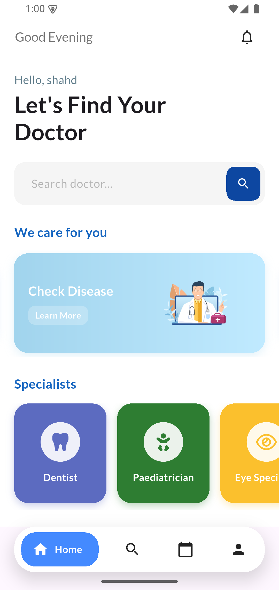
  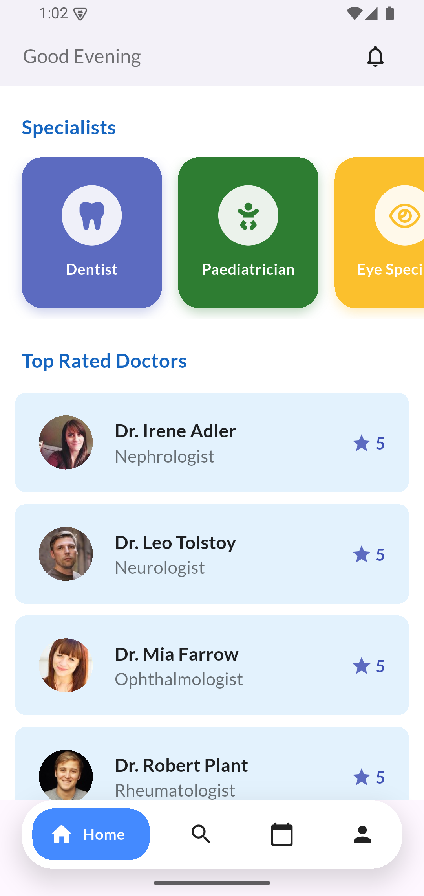
  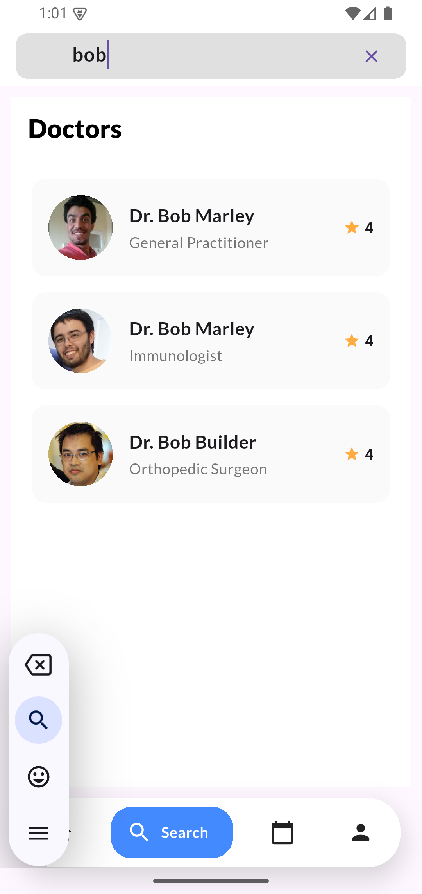

  
  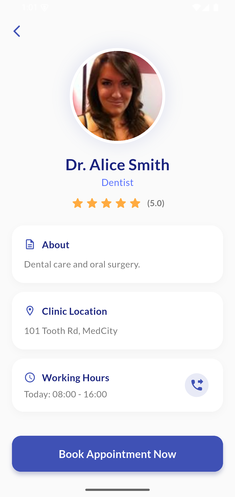
  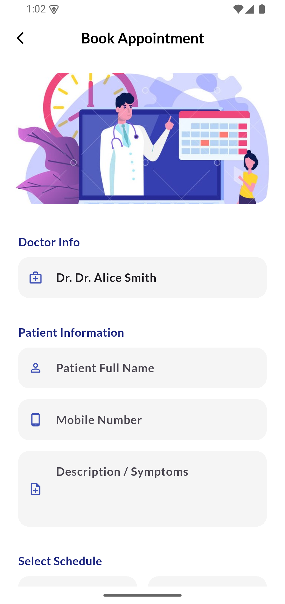

  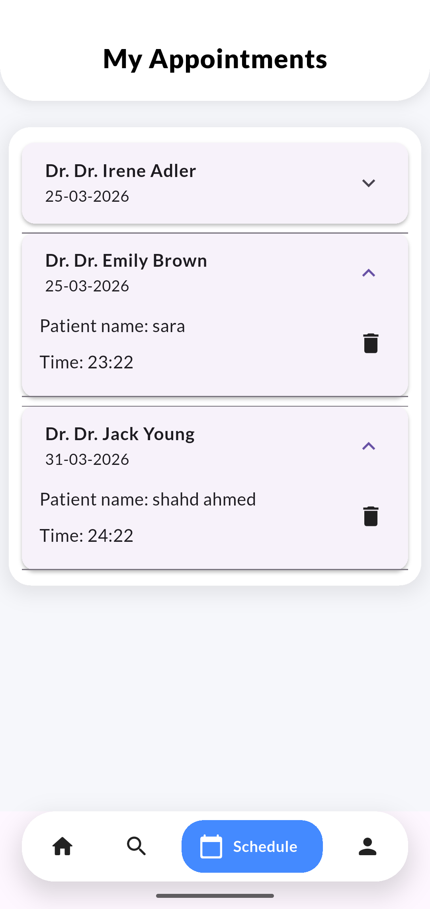
  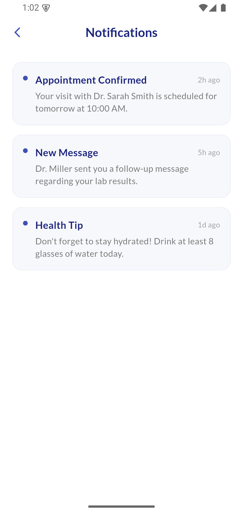
  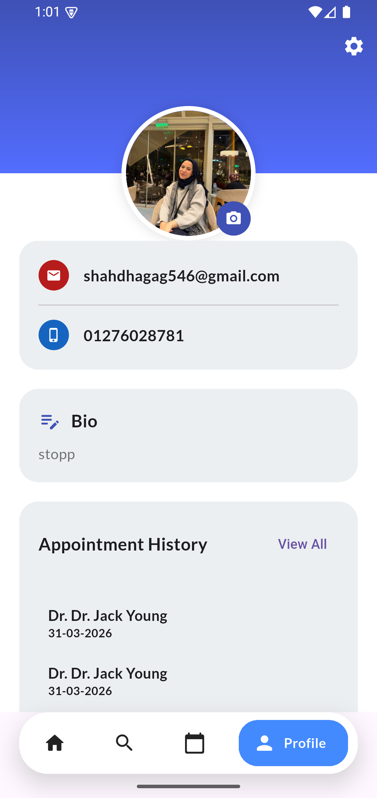

  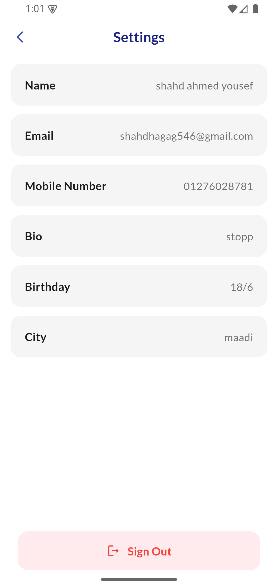
  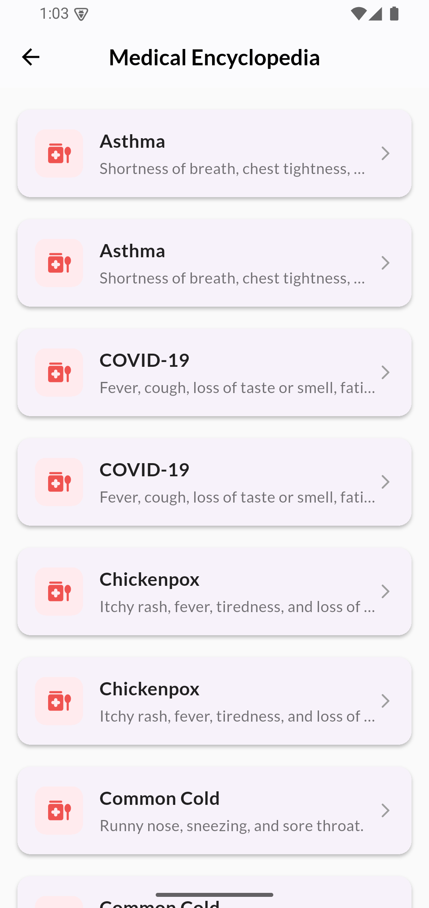
  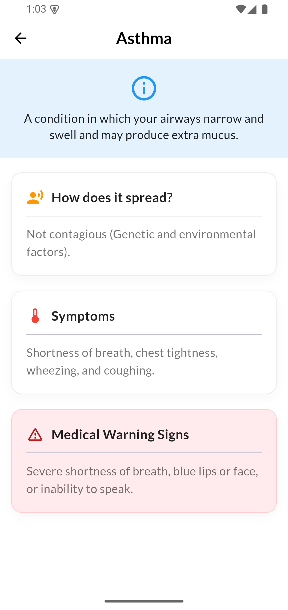

---

## ✨ Features

### 🔐 Authentication

* Email & Password Sign Up / Sign In
* Google Sign-In integration
* Facebook Sign-In integration
* Secure password reset functionality

---

### 🎯 Onboarding Experience

* Smooth multi-screen onboarding flow
* Introduces app features clearly
* User-friendly first-time experience

---

### 🏠 Home & Navigation

* Personalized home screen with dynamic greeting
* Quick access to main features
* Clean and intuitive navigation system

---

### 👨‍⚕️ Doctor Search & Discovery

* Search doctors by name or specialty
* Detailed doctor profiles (qualifications, specialties, ratings)
* Top-rated doctors section
* Explore and filter options

---

### 📅 Appointment Management

* Book appointments بسهولة
* View upcoming and past appointments
* Appointment history
* Cancel or reschedule appointments

---

### 👤 User Profile & Settings

* View and edit personal details
* Upload and update profile image
* Manage account settings
* Secure password update

---

### 🧠 Health & Disease Information

* Browse diseases
* View detailed disease information
* Symptoms and health insights

---

### 🔔 Notifications & Reminders

* Appointment reminders
* Real-time updates
* Notification history

---

## ⚙️ Technologies Used

### 🧩 Frontend

* Flutter (Dart)
* Material UI
* Responsive Design

### 🔥 Backend & Services

* Firebase Authentication
* Cloud Firestore
* Firebase Storage

### 🔑 Authentication Providers

* Google Sign-In
* Facebook Authentication

### 🛠 Packages

* cloud_firestore
* firebase_auth
* firebase_storage
* google_sign_in
* flutter_facebook_auth
* intl
* google_fonts

---

## 🚀 Summary

The **Health & Doctor Appointment App** delivers a complete digital healthcare experience. Users can securely sign in, explore doctors, book appointments, manage their profiles, and access valuable health information — all within a modern, clean, and responsive Flutter application.

---

## 📌 Future Improvements

* 💬 Chat between doctor and patient
* 📹 Video consultation
* 🤖 AI symptom checker
* 🧑‍💼 Admin dashboard

---

